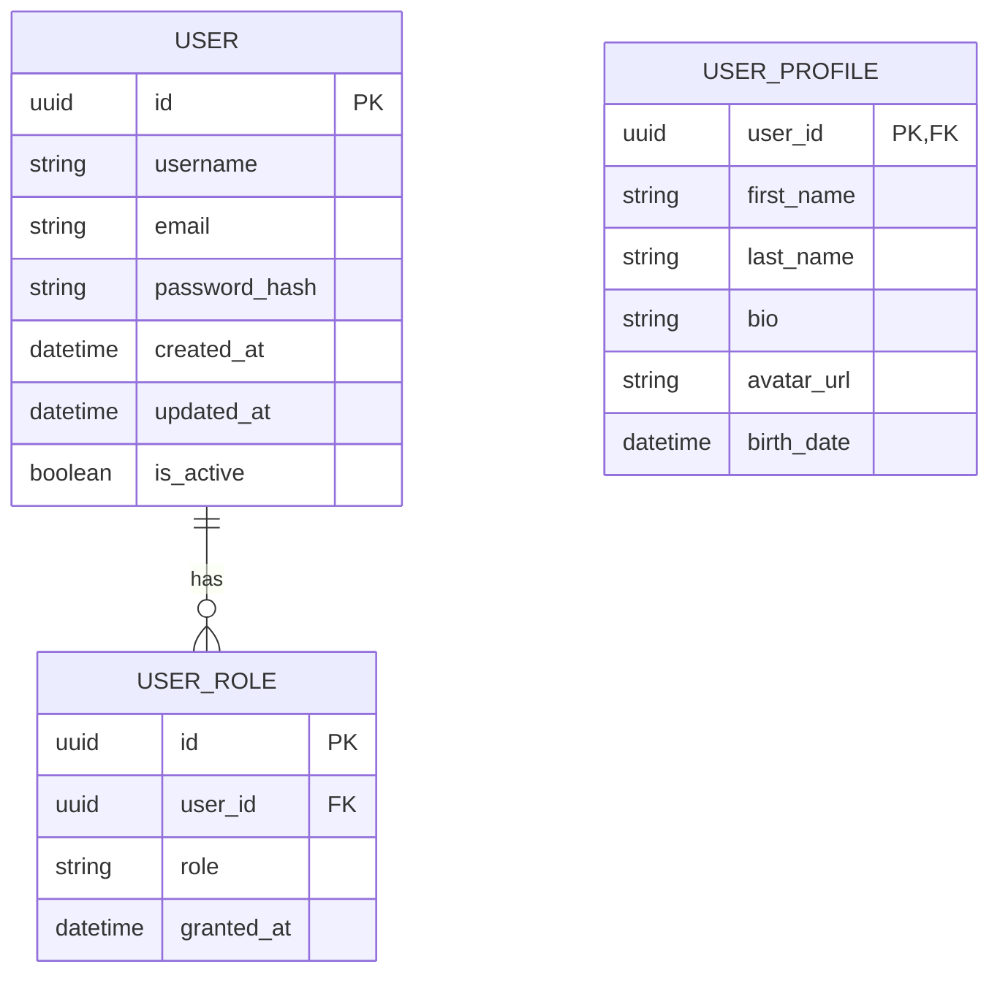
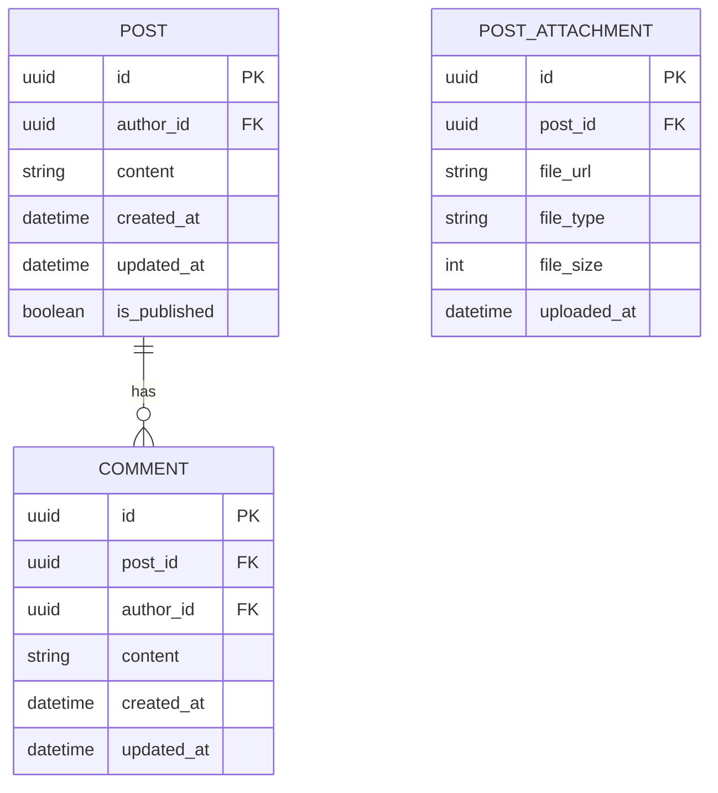
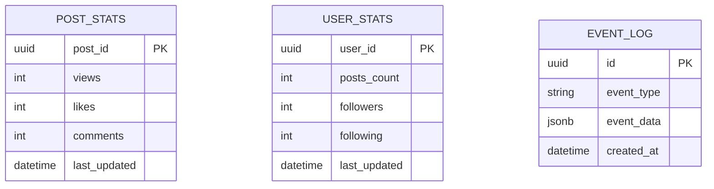

## ER диаграммы сервисов

### User Service

```mermaid
erDiagram
    USER ||--o{ USER_ROLE : has
    USER {
        uuid id PK
        string username
        string email
        string password_hash
        datetime created_at
        datetime updated_at
        boolean is_active
    }
    
    USER_ROLE {
        uuid id PK
        uuid user_id FK
        string role
        datetime granted_at
    }
    
    USER_PROFILE {
        uuid user_id PK,FK
        string first_name
        string last_name
        string bio
        string avatar_url
        datetime birth_date
    }
```

### Post Service

```mermaid
erDiagram
    POST ||--o{ COMMENT : has
    POST {
        uuid id PK
        uuid author_id FK
        string content
        datetime created_at
        datetime updated_at
        boolean is_published
    }
    
    COMMENT {
        uuid id PK
        uuid post_id FK
        uuid author_id FK
        string content
        datetime created_at
        datetime updated_at
    }
    
    POST_ATTACHMENT {
        uuid id PK
        uuid post_id FK
        string file_url
        string file_type
        int file_size
        datetime uploaded_at
    }
```

### Stats Service

```mermaid
erDiagram
    POST_STATS {
        uuid post_id PK
        int views
        int likes
        int comments
        datetime last_updated
    }
    
    USER_STATS {
        uuid user_id PK
        int posts_count
        int followers
        int following
        datetime last_updated
    }
    
    EVENT_LOG {
        uuid id PK
        string event_type
        jsonb event_data
        datetime created_at
    }
```